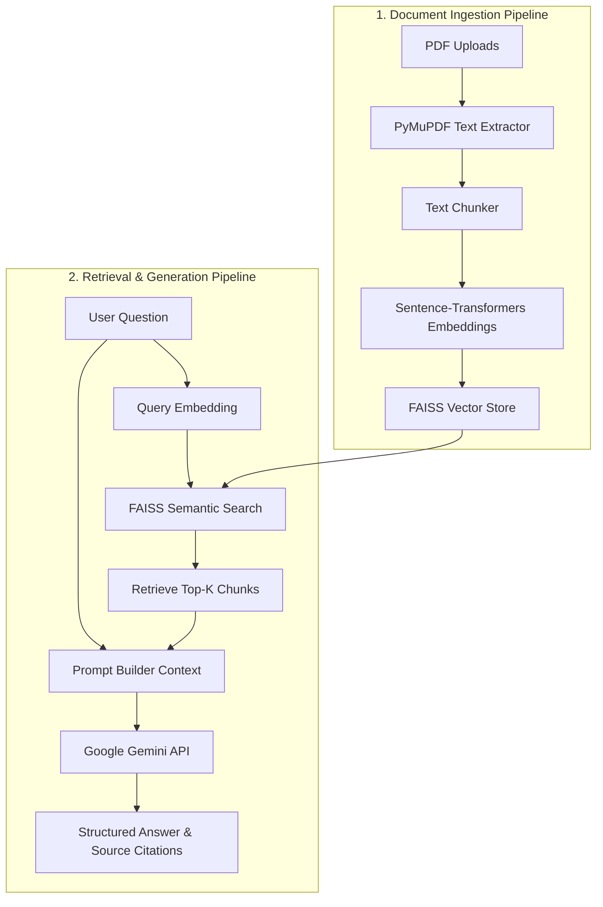

# 📚 BookWise AI

BookWise AI is an intelligent document assistant designed to help you interact with, query, and extract insights from your PDF documents. By leveraging a local vector database and Google's Gemini models via Retrieval-Augmented Generation (RAG), BookWise AI provides precise, context-aware answers along with page-level citations from your uploads.

---

## ✨ Features

- **Multi-PDF Upload & Indexing:** Upload and process multiple PDF documents simultaneously.
- **RAG-Powered Q&A:** Get context-aware answers generated using Google's Gemini models.
- **Source Citation:** Every answer lists the exact page numbers from which the information was retrieved.
- **Local Embedding Generation:** Generates dense vector embeddings using local sentence-transformers models.
- **Fast Similarity Search:** Uses a local FAISS index for high-performance semantic search.

---

## 🛠️ Tech Stack

BookWise AI is built using the following modern tools and frameworks:

* **Frontend/UI:** [Streamlit](https://streamlit.io/) — Interactive web UI.
* **Document Processing:** [PyMuPDF (fitz)](https://pymupdf.readthedocs.io/) — Fast PDF text extraction.
* **Embeddings:** [Sentence-Transformers](https://sbert.net/) — Local embedding generation using `all-MiniLM-L6-v2`.
* **Vector Database:** [FAISS (Facebook AI Similarity Search)](https://github.com/facebookresearch/faiss) — High-performance vector similarity search.
* **LLM Engine:** [Google GenAI SDK](https://github.com/google/generative-ai-python) — Integrates with Google's Gemini API (defaults to `gemini-flash-latest`).

---

## 📐 System Architecture

Below is the conceptual architecture of the RAG pipeline:



---

## 🚀 Getting Started

Follow these steps to set up and run BookWise AI locally:

### 1. Prerequisites
- **Python 3.10** or higher
- A **Google Gemini API Key** (Get one from [Google AI Studio](https://aistudio.google.com/))

### 2. Clone and Navigate to the Repository
```bash
git clone https://github.com/PS-khushee-sonagra/Bookwise.git
cd Bookwise
```

### 3. Set Up a Virtual Environment
Create and activate a python virtual environment:
```bash
# Windows
python -m venv .venv
.venv\Scripts\activate

# macOS / Linux
python3 -m venv .venv
source .venv/bin/activate
```

### 4. Install Dependencies
Install the required packages:
```bash
pip install streamlit google-genai sentence-transformers faiss-cpu PyMuPDF python-dotenv numpy
```

### 5. Configure Environment Variables
Create a `.env` file in the project root directory and add your Google Gemini API key:
```env
GEMINI_API_KEY=your_gemini_api_key_here
GEMINI_MODEL=gemini-flash-latest
```

---

## 🏃 Running the Application

Once the setup is complete, start the Streamlit server:

```bash
streamlit run streamlit_app.py
```

Open your browser and navigate to the local URL (usually `http://localhost:8501`).

1. **Upload** one or more PDFs using the sidebar/uploader.
2. Click **Index Document** to extract text, chunk, and embed them.
3. Type your question in the text box and click **Ask** to receive answers backed by source citations.
