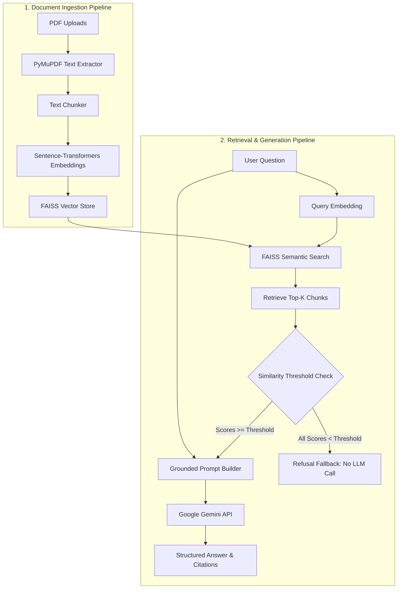

# 📚 BookWise AI

BookWise AI is an intelligent document assistant designed to help you interact with, query, and extract insights from your PDF documents. By leveraging a local vector database and Google's Gemini models via Retrieval-Augmented Generation (RAG), BookWise AI provides precise, context-aware answers along with page-level citations from your uploads.

---

## ✨ Features

- **Multi-PDF Upload & Indexing:** Upload and process multiple PDF documents simultaneously.
- **RAG-Powered Q&A:** Get context-aware answers generated using Google's Gemini models.
- **Source Citation:** Every answer lists the exact page numbers from which the information was retrieved.
- **Local Embedding Generation:** Generates dense vector embeddings using local sentence-transformers models.
- **Fast Similarity Search:** Uses a local FAISS index for high-performance semantic search.
- **Score-Based Relevance Filtering:** Rejects low-relevance document chunks before calling Gemini, saving tokens and API cost.
- **Persistent Indexing:** Keeps your indexed documents preserved across sessions unless you explicitly request a rebuild.

---

## 🛠️ Tech Stack

BookWise AI is built using the following modern tools and frameworks:

* **Frontend/UI:** [Streamlit](https://streamlit.io/) — Interactive web UI.
* **Document Processing:** [PyMuPDF (fitz)](https://pymupdf.readthedocs.io/) — Fast PDF text extraction.
* **Embeddings:** [Sentence-Transformers](https://sbert.net/) — Local embedding generation using `all-MiniLM-L6-v2`.
* **Vector Database:** [FAISS (Facebook AI Similarity Search)](https://github.com/facebookresearch/faiss) — High-performance vector similarity search.
* **LLM Engine:** [Google GenAI SDK](https://github.com/google/generative-ai-python) — Integrates with Google's Gemini API (defaults to `gemini-flash-latest`).

---

## 📐 System Architecture

Below is the conceptual architecture of the enhanced RAG pipeline:



---

## 🚀 Getting Started

Follow these steps to set up and run BookWise AI locally:

### 1. Requirements & Prerequisites
- **Python Version:** Python 3.10 to 3.14 (fully verified on Python 3.14.6)
- **Key Dependencies:** (Pinned in `requirements.txt`)
  - `streamlit` (UI)
  - `google-genai` (LLM generation)
  - `sentence-transformers` (Local embeddings)
  - `faiss-cpu` (Vector store)
  - `pymupdf` (PDF extraction)
  - `pytest` (Automated unit tests)

### 2. Clone and Navigate to the Repository
```bash
git clone https://github.com/PS-khushee-sonagra/Bookwise.git
cd Bookwise
```

### 3. Set Up a Virtual Environment
Create and activate a python virtual environment:
```bash
# Windows
python -m venv .venv
.venv\Scripts\activate

# macOS / Linux
python3 -m venv .venv
source .venv/bin/activate
```

### 4. Install Dependencies
Install the required packages from the pinned requirements list:
```bash
pip install -r requirements.txt
```

### 5. Configure Environment Variables
Copy the env template and customize it:
```bash
cp .env.example .env
```
Inside `.env`, configure the following:
- `GEMINI_API_KEY`: Your Google Gemini API Key (obtained from [Google AI Studio](https://aistudio.google.com/)).
- `GEMINI_MODEL`: The target LLM model name (defaults to `gemini-flash-latest`).
- `SIMILARITY_THRESHOLD`: Score threshold to filter low-relevance chunks (defaults to `0.35`).

---

## 🏃 Running the Application

Once the setup is complete, start the Streamlit server:

```bash
streamlit run streamlit_app.py
```

Open your browser and navigate to the local URL (usually `http://localhost:8501`).

1. **Upload** one or more PDFs using the sidebar/uploader.
2. Click **Index Document** to extract text, chunk, and embed them.
3. Type your question in the text box and click **Ask** to receive answers backed by source citations.

---

## 📸 Screenshots


---

## 🧪 Running Automated Tests

We use `pytest` for automated test coverage:
```bash
pytest
```
This runs all the unit and integration tests under the `tests/` folder. The manual verification scripts (`test_config.py`, etc.) are also retained in the root directory.

---

## 🔒 Security & Privacy

- **No API Key Logging:** API keys are never printed, written to logs, or exposed partially in stdout.
- **User-Friendly Error Handling:** Raw application/backend traceback exceptions are caught internally and logged in diagnostic files. The user is displayed a clean, generic error message in the Streamlit UI.
- **Local Data Ingestion:** All PDF parsing, text chunking, and embedding generation processes happen locally on your hardware. Only the small subset of relevant context chunks that pass the relevance filter is sent to Google's API to construct the response.

---

## ⚠️ Limitations & Future Improvements

### Current Limitations
- **CPU Embedding Speed:** Local sentence-transformers run on CPU by default, which can take 1-2 minutes for very large documents.
- **Hugging Face Rate Limits:** Model downloads from Hugging Face Hub are unauthenticated and subject to rate limiting if not cached.
- **Single Vector Store Scope:** Multiple file indexing merges into a single FAISS index, which clears and rebuilds whenever a new upload session is started.

### Future Improvements
- **Hybrid Search:** Combine FAISS dense retrieval with BM25 sparse search for improved lexical matching.
- **GPU Acceleration:** Leverage CUDA for fast FAISS searches and sentence-transformers encoding.
- **Metadata Filtering:** Allow filtering search results by filename, upload date, or user category before relevance matching.
